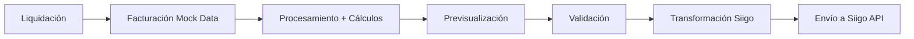

# Módulo de Facturación - Integración con Siigo

Este módulo gestiona la facturación electrónica con preparación para integración automática con **Siigo**, el sistema de facturación electrónica colombiano.

## 📋 Índice

- [Descripción General](#descripción-general)
- [Estructura del Módulo](#estructura-del-módulo)
- [Flujo de Datos](#flujo-de-datos)
- [Componentes](#componentes)
- [Integración con Siigo](#integración-con-siigo)
- [Datos Mock](#datos-mock)
- [Transición a Producción](#transición-a-producción)
- [Validaciones](#validaciones)

## Descripción General

El módulo de Facturación recibe información del módulo de **Liquidación** (trámites finalizados) y la complementa con datos del cliente para generar facturas listas para ser enviadas a Siigo.

### Características Principales

- ✅ Previsualización completa de facturas
- ✅ Cálculos automáticos (IVA, subtotal, total)
- ✅ Estructura de datos preparada para Siigo API
- ✅ Validación de datos antes del envío
- ✅ Simulación de envío a Siigo
- ✅ Gestión de estados (pendiente, enviada, pagada, anulada)
- ✅ Datos mock completos y realistas

## Estructura del Módulo

```
facturacion/
├── Main.jsx                        # Componente principal
├── index.js                        # Exportación del módulo
├── data/
│   └── mockData.js                 # Datos de prueba (Liquidación + Cliente)
├── utils/
│   └── siigoTransformer.js         # Transformación de datos para Siigo
└── components/
    ├── MainHeader.jsx              # Encabezado con contador de facturas
    ├── Filter.jsx                  # Filtros de búsqueda
    ├── MainTable.jsx               # Tabla de facturas
    ├── MainDialog.jsx              # Previsualización y envío de factura
    └── Pagination.jsx              # Paginación
```

## Flujo de Datos



### Paso a Paso

1. **Origen**: Los datos provienen del módulo de **Liquidación** (trámites finalizados)
2. **Complemento**: Se añade información del cliente (documento, dirección, email, etc.)
3. **Procesamiento**: Se calculan automáticamente IVA, subtotales y totales
4. **Validación**: Se verifica que todos los datos requeridos estén completos
5. **Transformación**: Los datos se convierten al formato de Siigo API
6. **Envío**: La factura se envía a Siigo (actualmente simulado)

## Componentes

### 1. MainHeader.jsx

Muestra el encabezado del módulo con contadores en tiempo real:
- Facturas pendientes
- Facturas enviadas

### 2. MainTable.jsx

Tabla principal que muestra todas las facturas con:
- ID de factura (interno y de Siigo)
- Datos del cliente
- Trámite y placa
- Valores (subtotal, IVA, total)
- Estado de la factura
- Acciones (ver, enviar a Siigo)

### 3. MainDialog.jsx

Dialog de previsualización completa de la factura con:
- **Información del Cliente**: nombre, documento, contacto, dirección
- **Información del Trámite**: tipo, placa, número, gestor
- **Detalle de Factura**: tabla con items, cantidades, precios
- **Totales**: subtotal, IVA, total
- **Validación**: alertas de errores si faltan datos
- **Acciones**: imprimir y enviar a Siigo

### 4. Filter.jsx

Filtros de búsqueda por:
- Texto (ID, cliente, placa)
- Estado (pendiente, enviada, pagada, anulada)
- Rango de fechas

### 5. Pagination.jsx

Paginación estándar con:
- Navegación entre páginas
- Selector de registros por página
- Indicador de registros mostrados

## Integración con Siigo

### Estructura de Datos para Siigo

El módulo incluye `utils/siigoTransformer.js` que transforma los datos internos al formato requerido por Siigo API.

#### Ejemplo de Factura para Siigo

```javascript
{
  document: {
    id: 24601, // ID tipo de documento en Siigo (Factura de Venta)
  },
  date: "2026-01-10",
  customer: {
    identification: "1234567890",
    branch_office: 0,
  },
  items: [
    {
      code: "TRA-TRASPASO",
      description: "Trámite de Traspaso de Vehículo",
      quantity: 1,
      price: 350000,
      taxes: [
        {
          id: 13156,
          percentage: 0,
        },
      ],
    },
    {
      code: "SRV-GESTION",
      description: "Servicio de Gestión Administrativa",
      quantity: 1,
      price: 450000,
      taxes: [
        {
          id: 13156,
          percentage: 19,
        },
      ],
    },
  ],
  payments: [],
  observations: "Factura por trámite Traspaso - Placa ABC123",
}
```

### Funciones de Transformación

#### `transformarClienteSiigo(cliente)`
Convierte los datos del cliente al formato Siigo:
- Tipo de documento (mapeo CC, NIT, CE, etc.)
- Información personal/empresarial
- Dirección con códigos DANE
- Contactos

#### `transformarFacturaSiigo(factura)`
Convierte la factura completa al formato Siigo:
- Información del documento
- Cliente
- Items/productos
- Impuestos
- Observaciones

#### `validarFacturaSiigo(factura)`
Valida que todos los datos requeridos estén presentes:
- Cliente completo
- Trámite
- Valores > 0

#### `enviarFacturaSiigo(factura)`
Simula el envío a Siigo API (en producción hace la llamada real):
- Valida datos
- Transforma al formato Siigo
- Simula respuesta exitosa

## Datos Mock

### Estructura de una Factura Mock

```javascript
{
  factura_id: 'FAC-2026-001',
  numero_factura: null, // Se asigna al enviar a Siigo
  estado: 'pendiente',
  fecha_creacion: '2026-01-10T15:30:00Z',
  fecha_vencimiento: '2026-01-25T23:59:59Z',

  // Cliente
  cliente: {
    tipo_documento: 'CC',
    numero_documento: '1234567890',
    nombre: 'Juan Carlos Martínez López',
    email: 'juan.martinez@email.com',
    telefono: '+57 310 123 4567',
    direccion: 'Calle 100 # 20-30',
    municipio: 'Bogotá',
    departamento: 'Bogotá D.C.',
  },

  // Trámite (desde Liquidación)
  tramite: {
    placa: 'ABC123',
    tipo_tramite: 'Traspaso',
    numero_tramite: 'TRA-2026-0123',
    proveedor_nombre: 'Juan Pérez',
    municipio_tramite: 'Bogotá',
  },

  // Valores económicos
  valores: {
    tramite_precio: 350000,
    servicio_empresa: 450000,
    iva_porcentaje: 19,
    iva_monto: 0, // Calculado automáticamente
    subtotal: 0,  // Calculado automáticamente
    total: 0,     // Calculado automáticamente
  },
}
```

### Datos Incluidos

El módulo incluye 5 facturas de prueba que representan:
- Diferentes tipos de cliente (persona natural, empresa)
- Diferentes tipos de documento (CC, NIT)
- Diferentes tipos de trámite (Traspaso, Matrícula, Duplicado, etc.)
- Diferentes estados (pendiente, enviada)
- Diferentes ciudades de Colombia

### Funciones Helper

```javascript
// Cálculos automáticos
calcularIVA(servicioEmpresa, porcentaje)
calcularSubtotal(tramitePrecio, servicioEmpresa)
calcularTotal(tramitePrecio, servicioEmpresa, ivaMonto)
procesarFactura(factura) // Aplica todos los cálculos

// Obtener datos
obtenerFacturasProcesadas() // Retorna facturas con cálculos

// Formateo
formatCurrency(amount)
formatDate(dateString)
formatDateTime(dateString)

// Estados
getEstadoColor(estado)
getEstadoLabel(estado)
```

## Transición a Producción

### Paso 1: Conectar con Liquidación Real

Reemplazar datos mock por datos reales del módulo de Liquidación:

```javascript
// Antes (mock):
import { obtenerFacturasProcesadas } from '../data/mockData';

// Después (real):
import { useSelector } from 'react-redux';
const { facturas } = useSelector(state => state.facturacionStore);
```

### Paso 2: Conectar con Backend

Crear thunks para obtener facturas desde el backend:

```javascript
// store/facturacionStore/facturacionThunks.js
export const getAllFacturasThunk = () => async (dispatch) => {
  const response = await axios.get('/api/facturacion/list/');
  dispatch(setFacturas(response.data));
};
```

### Paso 3: Configurar Siigo API

En `utils/siigoTransformer.js`, descomentar y configurar la llamada real:

```javascript
export const enviarFacturaSiigo = async (factura) => {
  const facturaFormatoSiigo = transformarFacturaSiigo(factura);

  // Llamada real a Siigo API
  const response = await axios.post(
    'https://api.siigo.com/v1/invoices',
    facturaFormatoSiigo,
    {
      headers: {
        'Authorization': `Bearer ${SIIGO_ACCESS_TOKEN}`,
        'Content-Type': 'application/json',
      }
    }
  );

  return response.data;
};
```

### Paso 4: Obtener Token de Siigo

Implementar flujo de autenticación OAuth 2.0 con Siigo:

```javascript
// Obtener token de acceso
const getAccessToken = async () => {
  const response = await axios.post('https://api.siigo.com/auth', {
    username: SIIGO_USERNAME,
    access_key: SIIGO_ACCESS_KEY,
  });
  return response.data.access_token;
};
```

## Validaciones

### Validaciones de Cliente

- ✅ Número de documento
- ✅ Email válido
- ✅ Dirección completa
- ✅ Teléfono

### Validaciones de Trámite

- ✅ Tipo de trámite
- ✅ Placa
- ✅ Número de trámite

### Validaciones de Valores

- ✅ Precio trámite > 0
- ✅ Servicio empresa > 0
- ✅ IVA calculado correctamente
- ✅ Total calculado correctamente

### Validaciones de Siigo

El módulo incluye validación completa antes del envío a Siigo:

```javascript
const validacion = validarFacturaSiigo(factura);
if (!validacion.valid) {
  // Mostrar errores
  alert(validacion.errors.join('\n'));
  return;
}
```

## Estados de Factura

| Estado | Descripción | Color |
|--------|-------------|-------|
| `pendiente` | Factura creada, no enviada a Siigo | Warning (amarillo) |
| `enviada` | Enviada a Siigo exitosamente | Info (azul) |
| `pagada` | Pagada por el cliente | Success (verde) |
| `anulada` | Factura anulada | Error (rojo) |

## Configuración de Siigo

### Códigos DANE

El módulo incluye mapeo de:
- Departamentos colombianos
- Municipios principales
- Tipos de documento

### IDs de Siigo

Configurar en `siigoTransformer.js`:
- ID de tipo de documento (24601 para Factura de Venta)
- ID de impuestos (13156 para IVA 19%)
- Códigos de productos/servicios

## Testing

### Probar el Módulo

1. Navegar a `/facturacion` en la aplicación
2. Ver 5 facturas de prueba en la tabla
3. Hacer clic en "Ver Factura" para previsualizar
4. Verificar que todos los cálculos sean correctos
5. Simular envío a Siigo (facturas pendientes)
6. Verificar que el estado cambie a "Enviada"

### Pruebas de Validación

1. Intentar enviar factura con datos incompletos
2. Verificar que se muestren alertas de error
3. Completar datos faltantes
4. Intentar enviar nuevamente

## Notas Importantes

- ✅ **Datos Mock Completos**: 5 facturas con toda la información necesaria
- ✅ **Cálculos Automáticos**: IVA, subtotal y total se calculan automáticamente
- ✅ **Estructura Siigo**: Datos ya preparados en formato Siigo API
- ✅ **Validación Completa**: Validaciones antes del envío
- ✅ **Sin Dependencias Nuevas**: Usa solo lo que existe en el proyecto
- ✅ **Código Limpio**: Separación de lógica, transformación y presentación
- ✅ **Fácil Transición**: Solo reemplazar mock por datos reales

## Documentación de Siigo API

- [Documentación oficial de Siigo API](https://siigoapi.docs.apiary.io/)
- [Autenticación OAuth 2.0](https://siigoapi.docs.apiary.io/#introduction/autenticacion)
- [Crear Factura de Venta](https://siigoapi.docs.apiary.io/#reference/facturas-de-venta/crear-factura-de-venta)

## Próximos Pasos

1. **Conectar con módulo de Liquidación real**
2. **Implementar autenticación con Siigo**
3. **Configurar webhooks de Siigo** (para notificaciones de pago)
4. **Agregar descarga de PDF** de facturas desde Siigo
5. **Implementar sincronización automática** de estados
6. **Agregar reportes de facturación**
